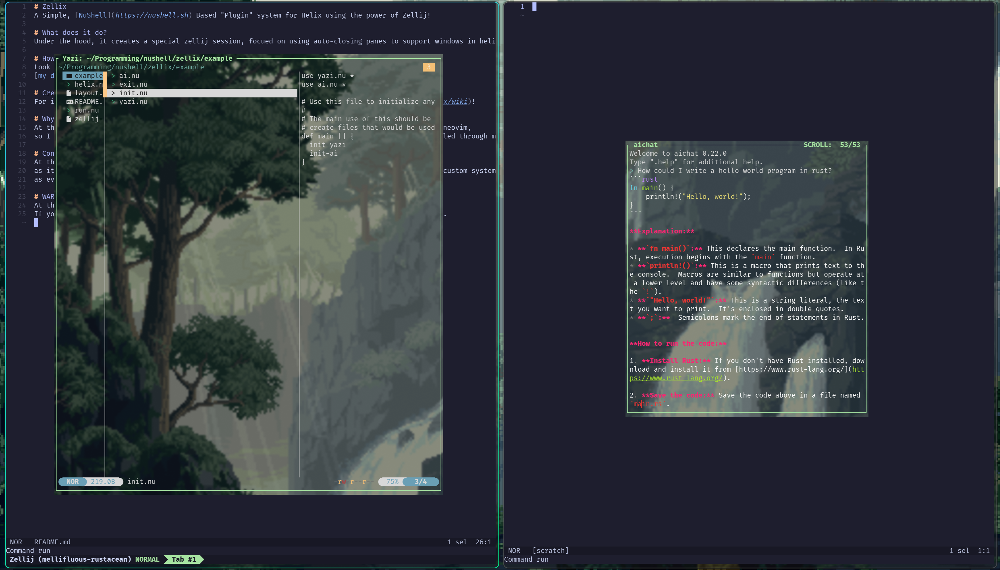

# Zellix
一个基于 [NuShell](https://nushell.sh) 的 Helix“插件”系统，借助 Zellij 的能力实现增强工作流。


## 🚀 增强特性（v2.0）

Zellix 针对项目管理与开发流程进行了显著增强：

### ✅ 新增改进

1. **集成 direnv 的项目切换增强**
   - 切换项目时自动执行 `direnv allow`
   - 项目级环境变量管理
   - 支持项目目录中的 `.envrc` 文件

2. **项目配置系统**
   - 支持 `.zellix/project.nu` 配置文件
   - 可配置项目元数据、环境变量与插件设置
   - 提供交互式创建工具 `create-project.nu`

3. **环境管理工具**
   - `load-env-from-record` 用于结构化环境加载
   - 支持带优先级的环境变量合并
   - 项目根目录检测与安全目录切换

4. **结构化日志系统**
   - 可配置日志级别（debug、info、warn、error、fatal）
   - 带时间戳的会话日志
   - 错误处理包装与性能计量

5. **新插件**
   - `logger.nu`：完整日志工具集
   - `create-project.nu`：交互式项目配置创建器

## 它做了什么？
底层会创建一个专用 zellij 会话，重点使用可自动关闭的 pane 来支撑 Helix 内的窗口化操作。

## 安装
如果你不想每次都在目录中直接运行，可以用 `ln` 和 `chmod` 安装。先进入 `run.nu` 所在目录。

在终端中运行：
```nu
chmod +x run.nu
```
使文件可执行。然后使用：
```nu
ln -s $(pwd)/run.nu ~/.local/bin/zlx
```
将 `run.nu` 链接到本地 bin 目录。之后可直接运行 `zlx`（或 `zlx path/to/file`），旧的 `zellix` 名称依旧兼容。

## 用法
使用 `zlx`（或兼容的 `zellix`）命令，配合下列可选标志启动会话：
- `-d <项目目录>`：指定项目目录（默认当前目录）。
- `-s <会话名>`：设置或复用 zellij 会话名（默认生成随机名称）。
- `-c <配置根路径>`：使用自定义的 zellix 配置目录（默认 `~/.config/zellix`）。
- `-l <布局文件>`：载入指定的 zellij 布局文件（默认 `config/zellij/layout.kdl`）。
- 其余位置参数按顺序作为 Helix 需要打开的文件/路径（等价于 `hx path/to/file`）。

示例：
```bash
zlx
zlx README.md
zlx -d ~/projects/my-app -s work-session -l config/zellij/layout_gruvbox.kdl
```

如果你只想体验 zellix，请先克隆仓库，并确认已安装 `zellij` 与 `helix`。
若要使用作者示例配置，建议安装 `yazi`，AI 面板则需要 `codex` 命令可用。

可在 Helix 配置里添加如下键位，或直接在 Helix 命令行粘贴执行：
`:sh zellij run -c -f -x 10% -y 10% --width 80% --height 80% -- nu $ZELLIX_MOD/yazi.nu`
上面会启动 yazi；把 `yazi.nu` 替换为 `ai.nu` 可启动 AI 模块。

如果你想按作者方式使用，可添加以下两个键位：
```toml
[keys.normal.space.f]
f = "file_picker"
t = ":sh zellij run -c -f -x 10% -y 10% --width 80% --height 80% -- nu $ZELLIX_MOD/yazi.nu"

[keys.normal.space.l]
a = ":sh zellij run -c -f -x 10% -y 10% --width 80% --height 80% -- nu $ZELLIX_MOD/ai.nu"
```

## 增强项目管理

### 创建新的项目配置
```bash
# 在项目目录内运行
nu $ZELLIX_MOD/create-project.nu
```

### 带环境管理的项目切换
增强后的 `project.nu` 现在会：
1. 自动检测并使用 `.envrc` 文件
2. 从 `.zellix/project.nu` 加载项目专属配置
3. 设置项目环境变量
4. 切换到项目目录

### 项目配置示例
在项目根目录创建 `.zellix/project.nu`：
```nu
{
  name: "my-project",
  env: {
    DATABASE_URL: "postgres://localhost/dev",
    API_KEY: "{{ENV_API_KEY}}",
    PROJECT_ROOT: "{{CWD}}"
  },
  plugins: {
    enabled: ["git", "makefile", "justfile"],
    disabled: ["ai"]
  }
}
```

## 可用插件

| 插件 | 说明 |
|--------|-------------|
| `project.nu` | 集成 direnv 的增强项目切换 |
| `create-project.nu` | 交互式项目配置创建器 |
| `logger.nu` | 结构化日志与错误处理 |
| `helpers.nu` | 环境管理工具 |
| `yazi.nu` | 文件管理器集成 |
| `ai.nu` | Codex CLI 智能体面板 |
| `git.nu` | Git 集成（lazygit） |
| `makefile.nu` | Make 命令运行器 |
| `justfile.nu` | Just 任务运行器 |
| `nnn.nu` | 终端文件管理器 |
| `terminal.nu` | 终端/Shell 集成 |
| `zk.nu` | 笔记系统 |
| `tangle.nu` | Org-mode tangle 集成 |
| `home-manager.nu` | Nix home-manager 集成 |
| `neomutt.nu` | 邮件客户端 |
| `markdown.nu` | Markdown 预览 |
| `remap.nu` | 键位重映射 |
| `sh.nu` | Shell 命令集成 |

## 环境变量

Zellix 会设置以下环境变量：

- `ZELLIX_PATH`：zellix 配置路径
- `ZELLIX_SESSION`：唯一会话标识符
- `ZELLIX_MOD`：插件目录路径
- `ZELLIX_TMP`：会话临时目录
- `ZELLIX_OPEN`：在 helix 中打开的文件
- `ZELLIX_PROJECT_DIR`：当前项目根目录（与 `-d` 选项同步）
- `ZELLIX_THEME_MODE`：本会话解析后的主题模式（`dark` 或 `light`）
- `ZELLIX_HELIX_THEME`：本会话应用的 Helix 主题
- `ZELLIX_LOG_LEVEL`：日志级别（debug、info、warn、error、fatal）
- `ZELLIX_LOG_FILE`：日志文件路径

主题覆盖变量（可选）：
- `ZLX_THEME_MODE`：强制模式为 `dark` 或 `light`
- `ZLX_HELIX_THEME_DARK` / `ZLX_HELIX_THEME_LIGHT`：Helix 主题名
- `ZLX_ZELLIJ_THEME_DARK` / `ZLX_ZELLIJ_THEME_LIGHT`：Zellij 主题名
- `ZLX_APPLY_ST_THEME`：设为 `true` 时，即使 `$TERM` 不是 `st*` 也强制应用运行时重着色钩子
- `ZLX_ST_BG_DARK` / `ZLX_ST_BG_LIGHT`：st 背景色（hex）
- `ZLX_ST_FG_DARK` / `ZLX_ST_FG_LIGHT`：st 前景色（hex）
- `ZLX_ST_CURSOR_DARK` / `ZLX_ST_CURSOR_LIGHT`：st 光标色（hex）

实时辅助命令：
- `nu ~/.config/zellix/zlx-theme.nu auto`（检测并应用 st 运行时颜色）
- `nu ~/.config/zellix/zlx-theme.nu dark`
- `nu ~/.config/zellix/zlx-theme.nu light`

Zellij 快捷键：
- `Alt-t`：切换 zlx 深色/浅色模式（对下次 zlx 会话生效）
- `Alt-Shift-t`：切换并重启当前 zlx 会话（立即应用 zellij/helix 主题）
- `Alt-e`：在当前 tab 左侧新增一个 `nnn` 文件浏览器面板，选中文件或目录后同步更新 Helix/终端的项目根

## 日志

通过环境变量设置日志级别：
```bash
export ZELLIX_LOG_LEVEL=debug
```

查看日志：
```bash
# 在 zellix 会话内
nu -c "use plugins/logger.nu *; get-logs 20"
```

## 为什么要做这个？
在写这段文字时，Helix 还没有插件系统。我也不喜欢 Neovim 的配置体验，
所以做了这个项目，以满足“在编辑器中获得更多系统能力且仍可从编辑器控制”的需求。

## 写了很棒的东西？
欢迎提 Pull Request，附上你的代码仓库链接，我会考虑合并！

## Awesome zellix
- **项目配置系统**：管理项目专属设置与环境
- **direnv 集成**：自动切换环境
- **结构化日志**：调试并监控 zellix 会话

## 贡献
### 警告
当前实现仍较为粗糙，尚未经过完整测试。
如果你选择使用它，请反馈你遇到的**任何**问题，我会尽快修复。

### 开发
测试改进时可运行：
```bash
# 运行核心功能测试
nu tests/test_core_functionality.nu

# 测试特定组件
nu tests/simple_test.nu
```
